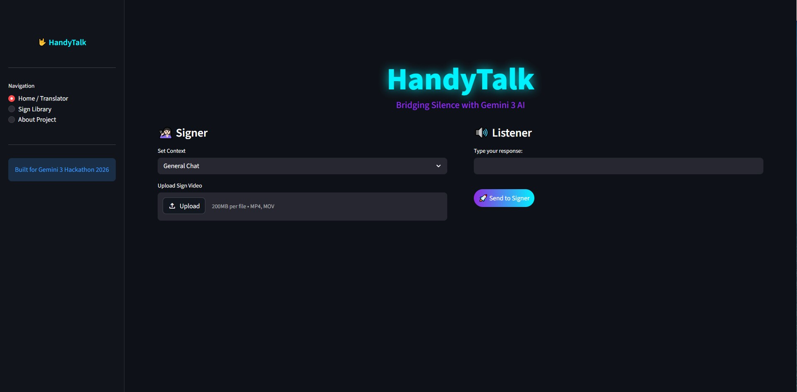
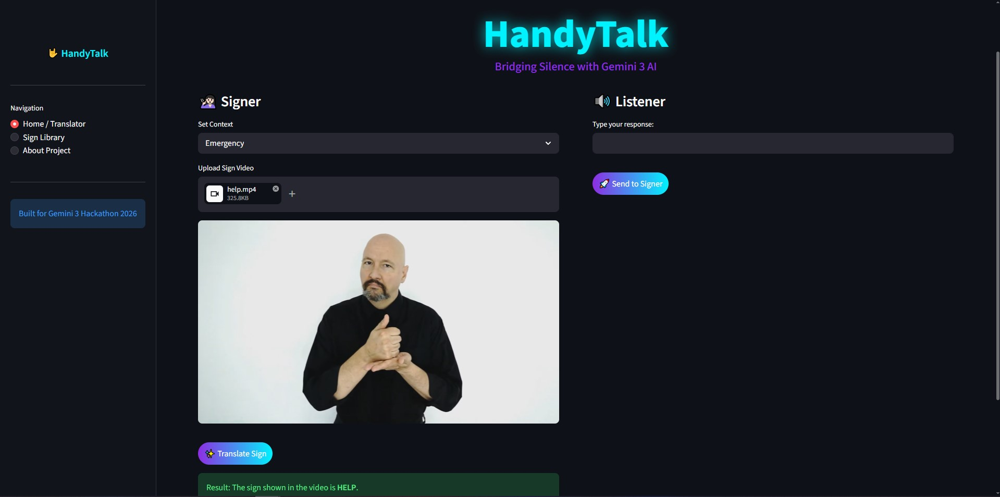
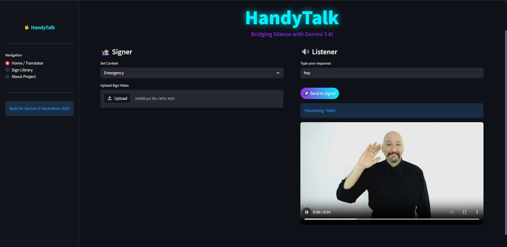
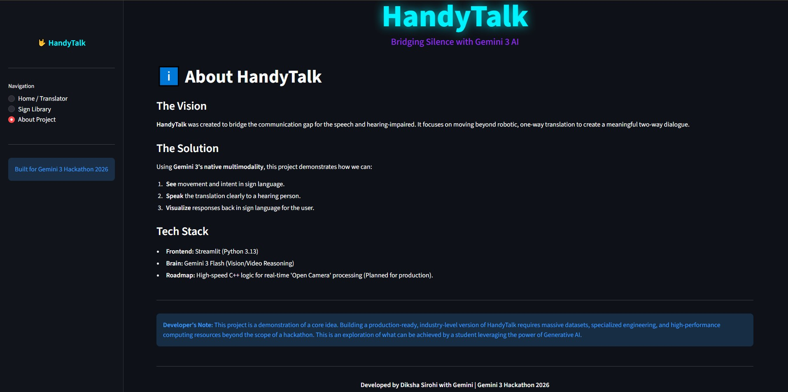

# HandyTalk 🤟  
### Bridging Silence with AI

HandyTalk is an AI-powered sign language interpretation prototype built during the Gemini 3 Hackathon 2026.

The project was created to address a major accessibility gap:

> Most translation systems are designed for spoken or typed language — but communication for deaf and mute individuals often relies on sign language, which many people cannot understand.

HandyTalk explores how AI, computer vision, and multimodal reasoning can help bridge that gap through gesture recognition and sign translation.

The current version demonstrates a proof-of-concept workflow using prerecorded sign videos and AI-assisted interpretation, with a long-term vision of enabling real-time sign language communication.

---

# 🚀 Vision

The goal of HandyTalk is to build an accessible communication assistant that can:

- Detect and understand sign language gestures
- Translate sign language into readable text or speech
- Visualize responses back into sign language
- Enable smoother two-way communication
- Reduce communication barriers in daily interactions

This project was developed under hackathon time constraints and focuses on validating the idea and workflow rather than delivering a production-ready system.

---

# ✨ Features

Current prototype capabilities include:

- Upload prerecorded sign videos
- AI-assisted sign interpretation
- Context-aware translation modes
- Listener-to-signer response visualization
- Interactive translation interface
- Modern accessibility-focused UI

---

# 📸 Screenshots

## 🏠 Home / Translator Interface


## ✋ Sign Upload and Translation


## 🗣️ Listener Response Visualization


## ℹ️ About Project Page


---

# 🧠 Current State of the Project

At the moment, HandyTalk:

- Uses prerecorded and uploaded gesture videos
- Processes gesture inputs through AI-assisted analysis
- Demonstrates the foundation of sign recognition
- Simulates communication between signer and listener
- Does **not yet support fully real-time sign detection**

This project represents the initial groundwork for a much larger accessibility-focused platform.

---

# 🛠️ Tech Stack

- Python
- Streamlit
- Gemini 3 Flash
- OpenCV
- Computer Vision
- Video Processing
- Multimodal AI

---

# 📂 Project Structure

```bash
HandyTalk/
│
├── signs/               # Sample sign videos/data
├── screenshots/         # README screenshots
│   ├── 1.jpg
│   ├── 2.jpg
│   ├── 3.jpg
│   └── 4.jpg
│
├── app.py               # Main application logic
├── requirements.txt
├── README.md
└── .gitignore
```

---

# ⚙️ Installation

Clone the repository:

```bash
git clone https://github.com/DikshaSirohi/HandyTalk.git
```

Move into the project directory:

```bash
cd HandyTalk
```

Install dependencies:

```bash
pip install -r requirements.txt
```

---

# ▶️ Running the Project

```bash
streamlit run app.py
```

---

# 🔍 How It Works

1. A prerecorded sign language video is uploaded
2. Video frames are processed using computer vision
3. Gemini analyzes gestures and context
4. Signs are translated into readable output
5. Responses can also be visualized back into sign language

---

# 🌟 Future Improvements

The long-term vision for HandyTalk includes:

- Real-time webcam-based sign detection
- Deep learning gesture recognition
- Sentence-level translation
- Text-to-speech support
- Speech-to-sign generation
- Multi-language support
- Mobile application deployment
- Faster real-time inference
- Improved training datasets
- Facial expression and emotion recognition

---

# 💭 Inspiration

HandyTalk was inspired by the idea of making communication more inclusive.

Translation tools are everywhere today, but most assume spoken or typed input. For people who communicate through sign language, communication barriers still exist in education, healthcare, workplaces, and everyday life.

This project explores how AI and multimodal systems can help reduce those barriers and create more accessible interactions.

---

# ⚠️ Developer Note

This project is a proof-of-concept built during a hackathon.

Building a production-ready, real-time sign language interpretation system would require:

- Large-scale datasets
- Specialized gesture-recognition models
- High-performance real-time processing
- Extensive accessibility testing

HandyTalk is an exploration of what can be achieved using modern generative AI and computer vision tools within a limited development timeframe.

---

# 👩‍💻 Author

Developed by Diksha Sirohi  
Built for Gemini 3 Hackathon 2026 🚀